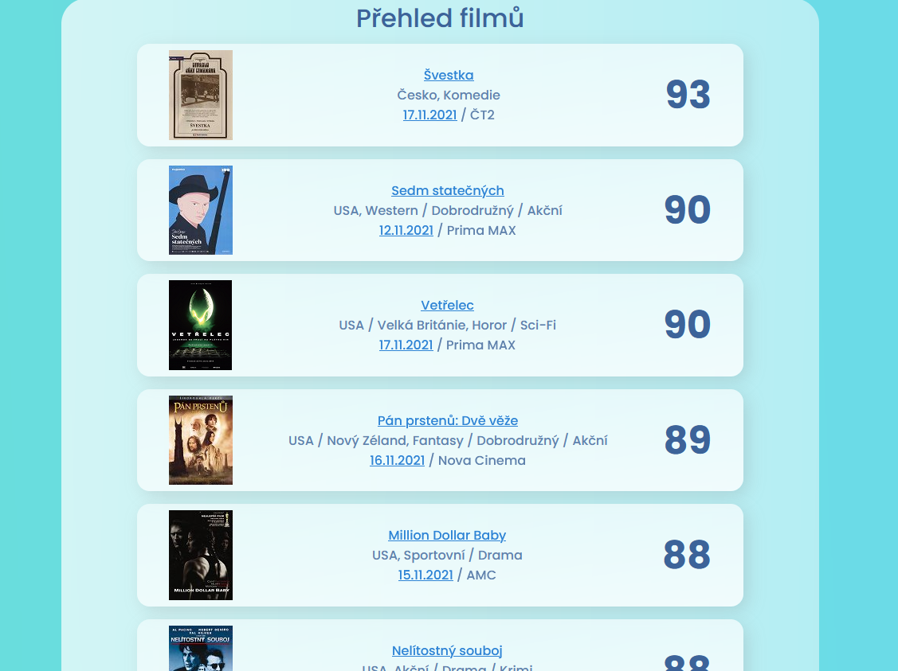

# CSFD_movies_rating
A python script for finding a movie result on www.csfd.cz, save it to a database and a result is displayed as a website via Flask library.

csfd_git.py
This script is the heart of this project. :)
The script have these steps:
1) Goes to url www.csfd.cz

database

web.py
